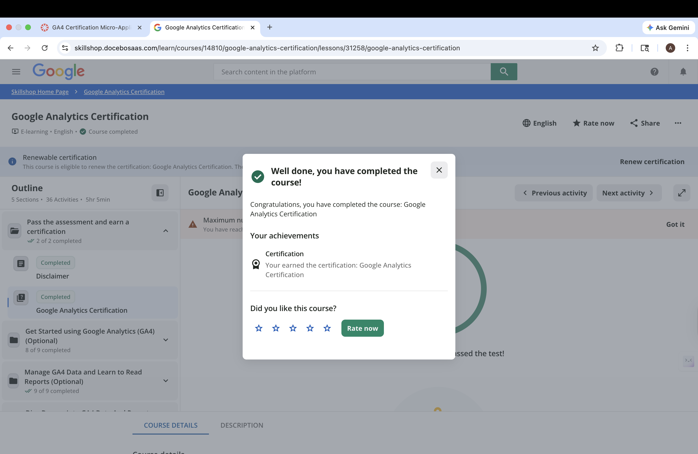
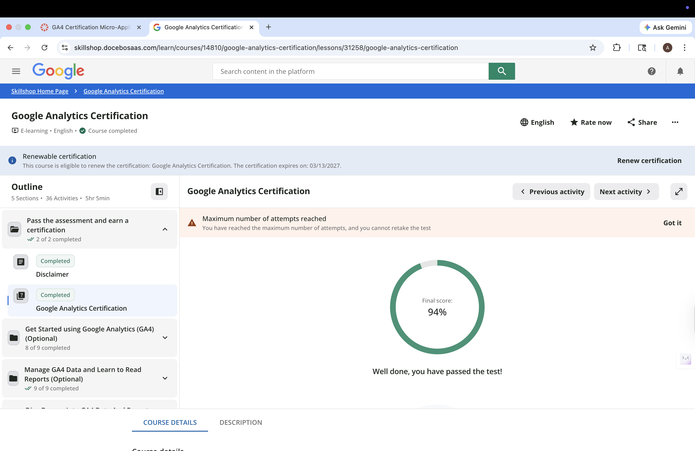
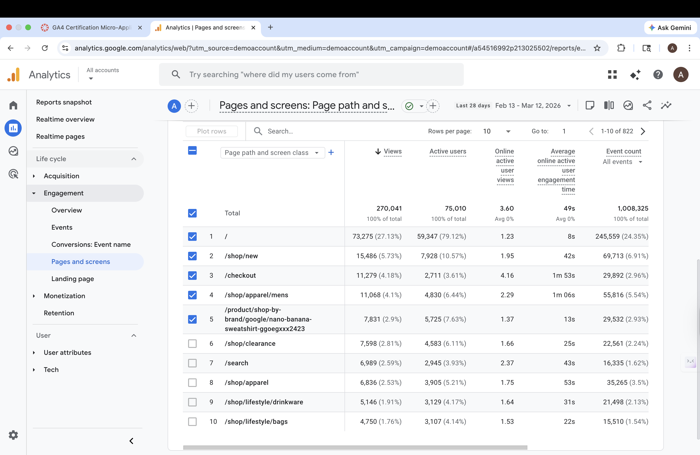

# GA4 Certification Exam

## Proof of Completion

## Result Summary

I passed the Google Analytics certification exam with a score of 94%. 

## Top 3 Challenging Topics

- The difference between events, conversions, and key events in GA4.
- Knowing which reports to use to analyze specific types of data.
- Seeing how real-time reports track the activity of users.

## Two Questions I Wish I Could Redo

One question I would like to review again is how GA4 tracks events and conversions. I found it a bit confusing to remember which events get tracked and which ones need to be manually.

Another question I would like to redo is the reports and exploration. Some questions you need to know which report gives the best insight for a certain task to analyze. 

## CEP Connection

One thing I will change in my CEP measurement plan is focusing more on engagement metrics like page views and user activity. The metrics can help see which pages are the best and how users interact with the site, which can help with future decision-making.

# GA4 Readiness Check

## KPI and Supporting Report

The KPI I would focus on is page views because it shows how many times users visit some pages on a website. The Pages and Screens report helps analyze which pages get the most traffic. This info can help see the most popular content and also areas where improvements could better users interaction on the website.

